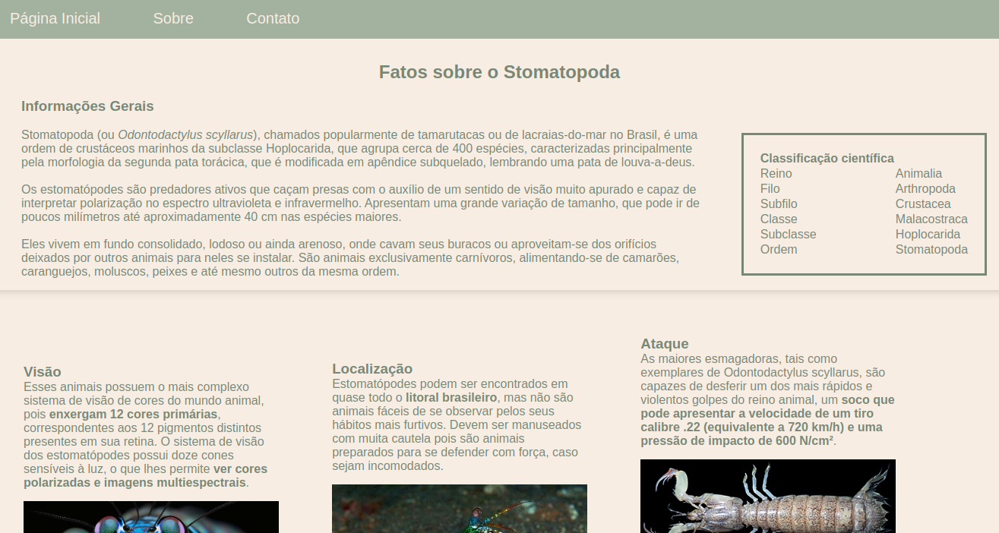

# README: Stomatopoda Project



<br/>

This is my first project at Trybe, a week into the course we were asked to create a page containing information about a crustacean.

## Project Description

This HTML project aims to provide information about Stomatopoda. Below are the key aspects of the project:

### Project Structure

The project consists of a single HTML file (`index.html`) and an external CSS file (`style.css`) for styling. 

### Technologies

- LINUX
- VSCODE
- HTML
- CSS

### What I Learned

- How to do a header/footer
- How to do a navbar
- How to work with sessions 
- How to organize a page
- A lot of HTML tags

## How to Run the Project

1. Clone the repository:

   ```bash
   git clone https://github.com/feduarte-dev/stomatopoda-page
   ```

2. Navigate to the project directory:

   ```bash
   cd your-repository
   ```

3. Open index.html with live server:

## Contributions

[Felipe](https://www.linkedin.com/in/feduarte-dev/) - HTML and CSS


[Trybe](https://www.betrybe.com/) - Everything else
